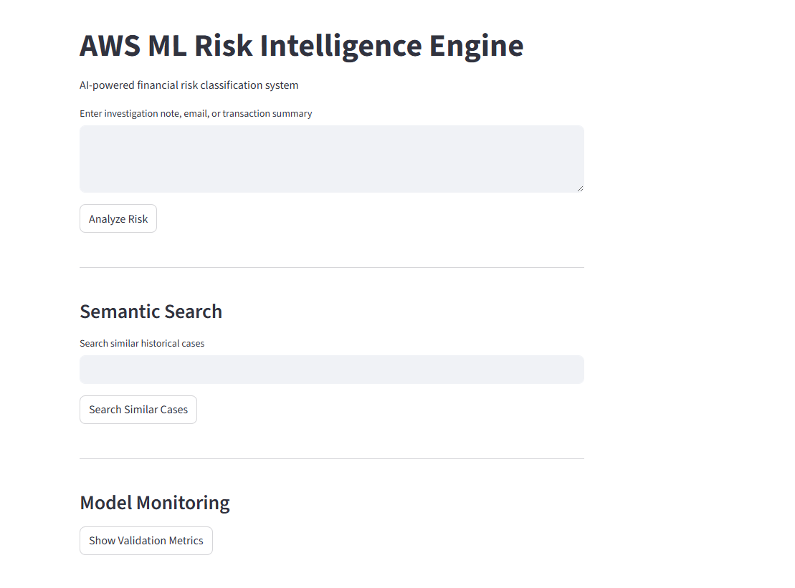
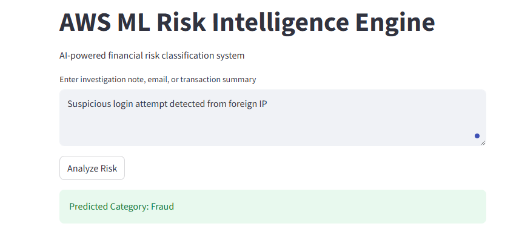
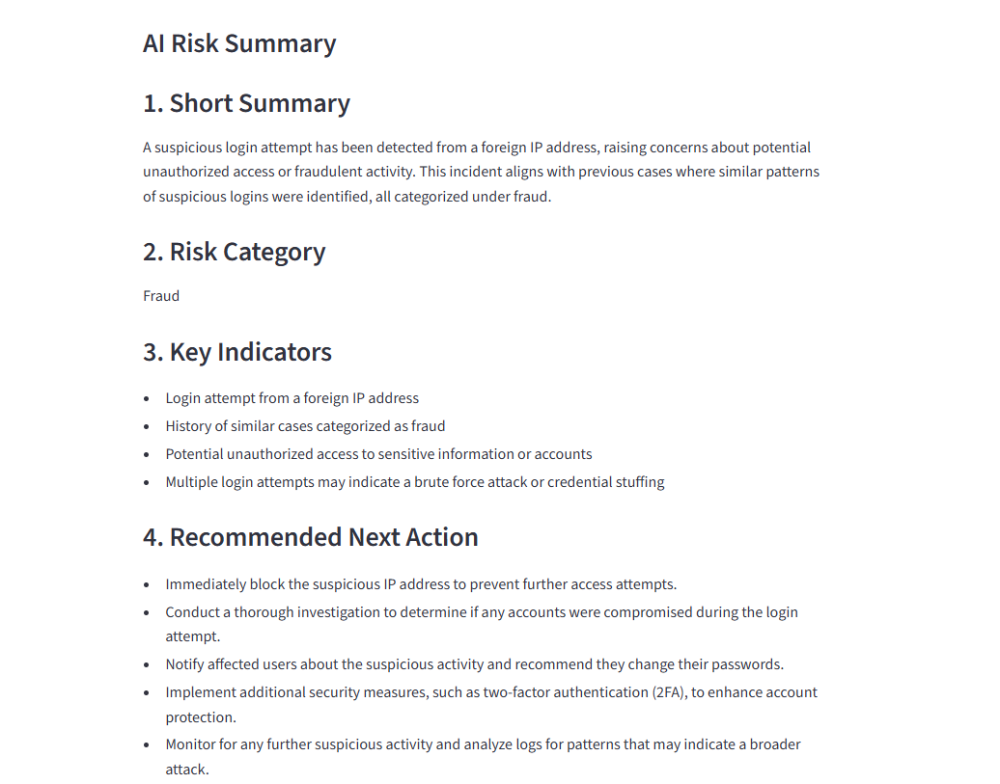
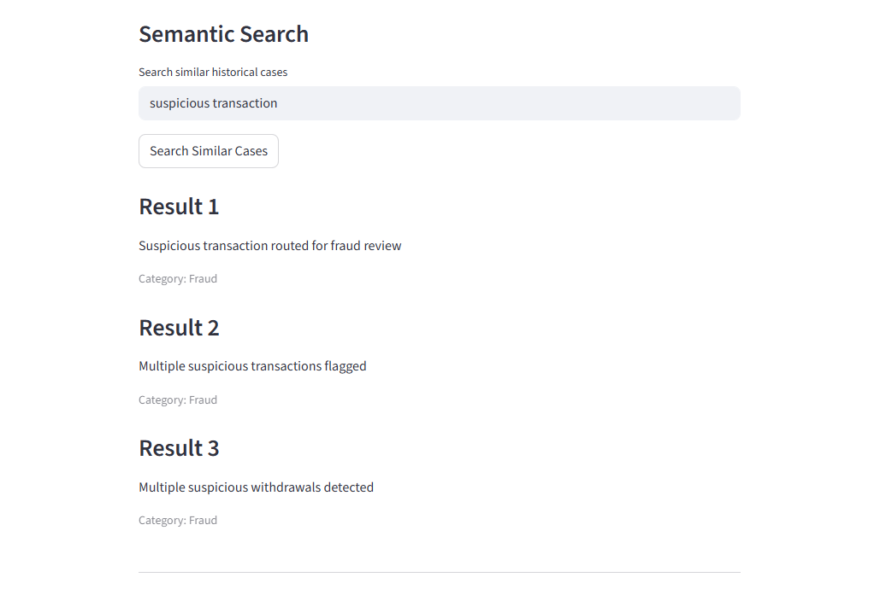
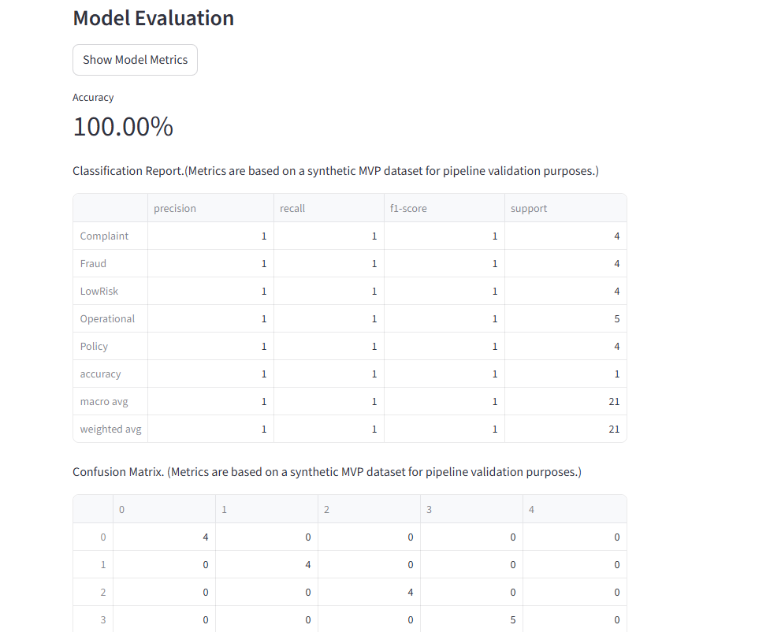

# AWS ML Risk Intelligence Engine

## Overview
Enterprise-style AI/ML platform for financial risk classification, semantic search, and AI-assisted investigation analysis.

## Features
- ML-based risk classification
- Semantic search using vector embeddings
- AI-generated risk summaries
- Prediction logging
- Model evaluation dashboard
- Streamlit interactive UI

## Tech Stack
- Python
- Streamlit
- Scikit-learn
- LangChain
- OpenAI
- FAISS
- Pandas

## Architecture
User Input
→ ML Classification
→ Semantic Search
→ AI Summary Generation
→ Logging & Monitoring

## AWS Integration

The application integrates AWS cloud-native services to support scalable AI/ML workflows and enterprise-ready architecture.

### Current AWS Integrations
- Amazon S3 for cloud storage
- Amazon Bedrock for GenAI-powered risk summaries
- AWS CLI and Boto3 integration

## AWS Services Used

| Service | Purpose |
|---|---|
| Amazon S3 | Dataset and artifact storage |
| Amazon Bedrock | AI-generated risk summaries |
| Boto3 | AWS SDK integration |
| AWS CLI | Credential and environment configuration |

## Future Enhancements

- SageMaker model deployment
- OpenSearch vector database
- Lambda orchestration workflows
- CloudWatch monitoring
- API Gateway integration
- CI/CD pipelines

## Application Preview

### Home Page

---

### Risk Analysis

---

### AI Risk Summary

---

### Semantic Search

---

### Model Monitoring

